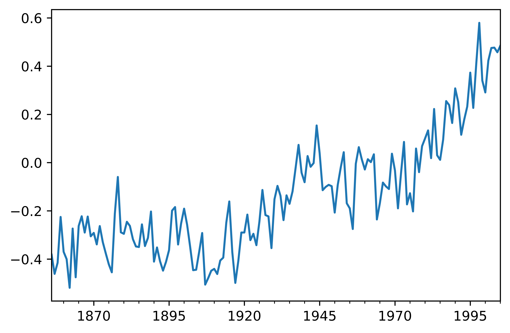
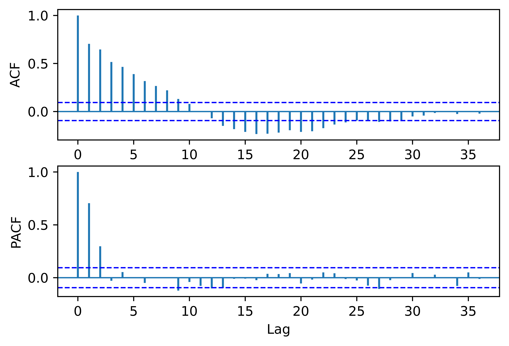
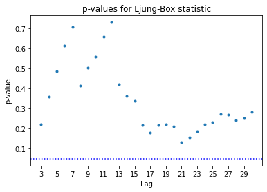
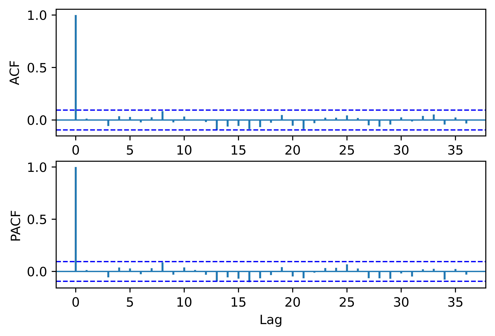
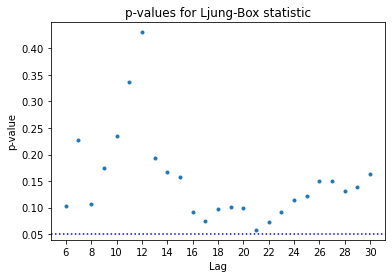

[](http://quantlet.de/)

## [](http://quantlet.de/) **pyTSA_GlobalTemperature** [](http://quantlet.de/)

```yaml


Name of Quantlet:    'pyTSA_GlobalTemperature'

Published in:        'Applied Time Series Analysis and Forecasting with Python'

Description:         'This Quantlet builds plots time series and ACF of Chinese quarterly GDP from 1992 to 2017'

Keywords:            'time series, autocorrelation, Chinese GDP, plot, visualisation'

Author:              Huang Changquan, Alla Petukhina

Datafile:            gdpquarterlychina1992.1-2017.4.csv


```













### PYTHON Code
```python

import numpy as np
import pandas as pd
import matplotlib.pyplot as plt
import math
import statsmodels.api as sm
from PythonTsa.plot_acf_pacf import acf_pacf_fig
from PythonTsa.LjungBoxtest import plot_LB_pvalue
from statsmodels.tsa.arima_model import ARMA
gtem = pd.read_csv('GlobalTemperature.txt', header = None, sep = '\s+')
gtemts = pd.concat([gtem.loc[0], gtem.loc[1]], ignore_index = 'true')
for i in range(2, len(gtem)):
    gtemts = pd.concat([gtemts, gtem.loc[i]], ignore_index = 'true')
    dates = pd.date_range('1856-01', periods = len(gtemts), freq = 'M')
    gtemts.index = dates
gtemts.plot()
plt.savefig('pyTSA_GlobalTemberature_fig5-20.png', dpi = 1200, 
             bbox_inches ='tight', transparent = True, legend = None); plt.show()
ygtemts = gtemts.resample(rule = '12M', kind = 'period').mean()
# transform gtemts into annual mean data
ydates = pd.date_range('1856', periods = len(ygtemts), freq = 'A')
ygtemts.index = ydates
ygtemts.plot()
plt.savefig('pyTSA_GlobalTemberature_fig5-21.png', dpi = 1200, 
             bbox_inches ='tight', transparent = True, legend = None); plt.show()
temp = gtemts['1970-01' : '2005-12']
COS = np.zeros((len(temp), 6))
SIN = np.zeros((len(temp), 6))
SIN.shape # a 432*6 zero matrix
tim = np.zeros((len(temp)))
for i in range(36):
    for j in range(12):
            tim[i*12+j] = 1970.0+i+j/12.0
# tim is a time variable similar to the function 'time' in R.
pi = math.pi
for i in range(6):
    COS[:, i] = np.cos(2 * pi * (i+1) * tim)
    SIN[:, i] = np.sin(2 * pi * (i+1) * tim)
    TIME = (tim- np.mean(tim))/np.sqrt(np.var(tim))
# tim is standardized for reducing computation error.
np.mean(tim)
np.sqrt(np.var(tim))
Z = np.column_stack((TIME, COS[:, 0], SIN[:, 0], COS[:, 1], 
SIN[:, 1], COS[:, 2], SIN[:, 2], COS[:, 3], SIN[:, 3], 
COS[:, 4], SIN[:, 4], COS[:, 5], SIN[:, 5]))
Z = sm.add_constant(Z)
# adding the constant term.
OLSmod = sm.OLS(temp, Z).fit()
print(OLSmod.summary())
X = np.column_stack((TIME, SIN[:, 0], SIN[:, 1]))
X = sm.add_constant(X)
OLSmodel = sm.OLS(temp, X).fit()
print(OLSmodel.summary())
OLSresid = OLSmodel.resid
acf_pacf_fig(OLSresid, both = True, lag = 36)
plt.savefig('pyTSA_GlobalTemberature_fig5-22.png', dpi = 1200, 
             bbox_inches ='tight', transparent = True, legend = None)
sm.tsa.kpss(OLSresid, regression = 'c', lags = 'auto')
ar2 = ARMA(OLSresid, order = (2, 0)).fit(trend = 'nc')
print(ar2.summary())
ar2Resid = ar2.resid
acf_pacf_fig(ar2Resid, both = True, lag = 36)
plt.savefig('pyTSA_GlobalTemberature_fig5-23.png', dpi = 1200, 
             bbox_inches ='tight', transparent = True, legend = None)
plot_LB_pvalue(ar2Resid, noestimatedcoef = 2, nolags = 30); plt.savefig('pyTSA_GlobalTemberature_fig5-24.png', dpi = 1200, 
             bbox_inches ='tight', transparent = True, legend = None)
Y = np.column_stack((TIME, SIN[:, 0], SIN[:, 1]))
regar = ARMA(temp, order = (2, 0), exog = Y).fit(trend = 'c')
# exog should not include a constant, specifying this in the "fit".
print(regar.summary())
regarResid = regar.resid
acf_pacf_fig(regarResid, both = True, lag = 36)
plt.savefig('pyTSA_GlobalTemberature_fig5-25.png', dpi = 1200, 
             bbox_inches ='tight', transparent = True, legend = None)
plot_LB_pvalue(regarResid, noestimatedcoef = 5, nolags = 30); plt.savefig('pyTSA_GlobalTemberature_fig5-26.png', dpi = 1200, 
             bbox_inches ='tight', transparent = True, legend = None)
```

automatically created on 2022-02-28