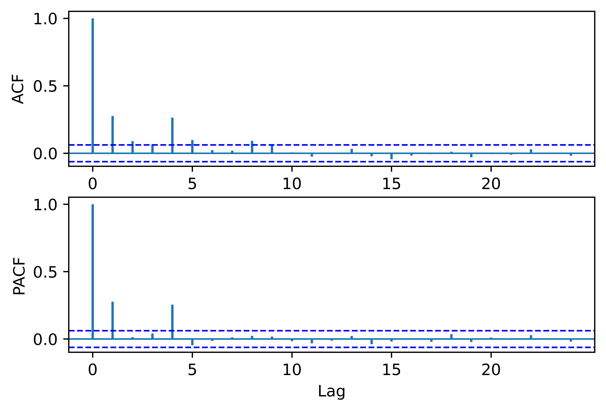

[](http://quantlet.de/)

## [](http://quantlet.de/) **pyTSA_SimSARMA** [](http://quantlet.de/)

```yaml


Name of Quantlet:    'pyTSA_SimSARMA'

Published in:        'Applied Time Series Analysis and Forecasting with Python'

Description:         'This Quantlet simulates ARMA(2,2) - autoregressive moving average process and draws the true ACF and PACF'

Keywords:            'time series,  stationarity, autocorrelation, PACF, ACF, simulation, stochastic process, ARMA, moving average, autoregression'

Author[New]:         Huang Changquan, Alla Petukhina


```




### PYTHON Code
```python

import pandas as pd
import numpy as np
import statsmodels.api as sm
from PythonTsa.plot_acf_pacf import acf_pacf_fig
import matplotlib.pyplot as plt
phi = np.r_[0.2]
theta = np.r_[0.0]
Phi = np.r_[0.3]
Theta = np.r_[0.0]
sigma2 = 4.0
params = np.r_[phi, theta, Phi, Theta, sigma2]
sarsim = sm.tsa.SARIMAX([0], order = (1, 0, 1), seasonal_order =
                        (1, 0, 1, 4)).simulate(params = params, nsimulations = 1000)
simts = pd.Series(sarsim)
acf_pacf_fig(simts, both = True, lag = 24)
plt.savefig('pyTSA_SimSARMA_fig5-9.png', dpi = 1200, 
             bbox_inches ='tight', transparent = True, legend = None);
sarima1010 = sm.tsa.SARIMAX(simts, order = (1, 0, 0), seasonal_order = (1, 0, 0, 4))
sarimaRes1010 = sarima1010.fit()
print(sarimaRes1010.summary())
phi = np.r_[0.0]
theta = np.r_[0.5]
Phi = np.r_[0.0]
Theta = np.r_[0.4]
sigma2 = 4.0
params = np.r_[phi, theta, Phi, Theta, sigma2]
smasim = sm.tsa.SARIMAX([0], order = (1, 0, 1), seasonal_order = 
                        (1, 0, 1, 4)).simulate(params = params, nsimulations = 1000)
simts = pd.Series(smasim)
acf_pacf_fig(simts, both = True, lag = 24)
plt.savefig('pyTSA_SimSARMA_fig5-10.png', dpi = 1200, 
             bbox_inches ='tight', transparent = True, legend = None);
sarima0501 = sm.tsa.SARIMAX(simts, order = (0, 0, 5), seasonal_order = (0, 0, 1, 4))
sarimaRes0501 = sarima0501.fit()
print(sarimaRes0501.summary())
phi = np.r_[0.2]
theta = np.r_[0.5]
Phi = np.r_[0.3]
Theta = np.r_[0.4]
sigma2 = 4.0
params = np.r_[phi, theta, Phi, Theta, sigma2]
smasim = sm.tsa.SARIMAX([0], order = (1, 0, 1), seasonal_order = 
                        (1, 0, 1, 4)).simulate(params = params, nsimulations = 1000)
simts = pd.Series(smasim)
acf_pacf_fig(simts, both = True, lag = 24)
plt.savefig('pyTSA_SimSARMA_fig5-11.png', dpi = 1200, 
             bbox_inches ='tight', transparent = True, legend = None);
```

automatically created on 2022-02-28